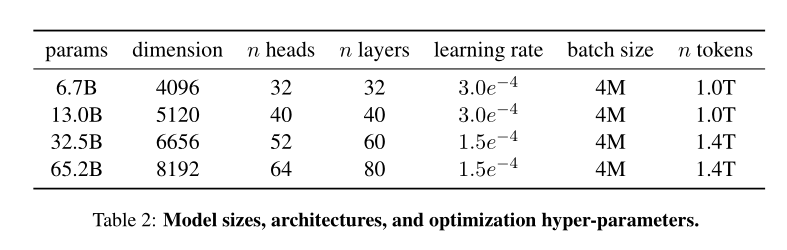
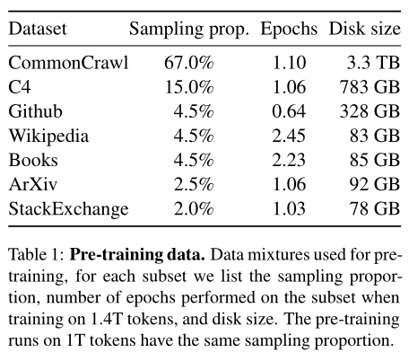
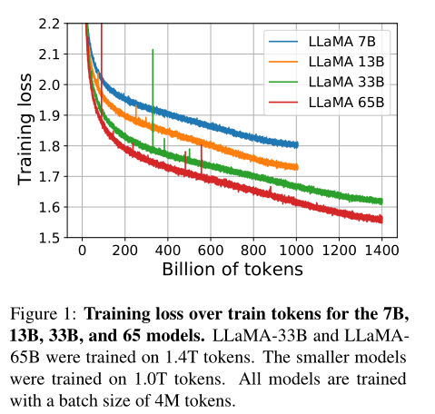
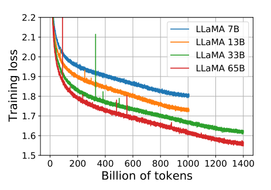

## llama1
llama1 是一个预训练模型，对标GPT3.
### 扩展法则
llama1 的作者提及了一个扩展法则的概念

[Chinchilla scaling laws](https://arxiv.org/pdf/2203.15556)

要点：
- 缩放法则：最优的令牌与参数比率约为2500亿令牌每10亿参数。
- 性能：在更多数据上训练的小型模型可以与在较少数据上训练的大型模型表现出相当的性能。
- 推理效率：小型模型在推理过程中可以更高效，这对于实际应用非常重要。
### Tokenizer
- BPE 算法，SentencePiece实现
- 所有的数字会被拆分成单个数字
- 无法正确解析的 UTF-8 编码字符会转成字节序列
- FFN中间维度：8/3d
### 模型架构

【1】
- Pre-normalization( RMSNorm)
- SwiGLU
- Rotary Embeddings

### 训练设置
优化器：AdamW
- β1 =0.9,β2 =0.95
- cosine learning rate schedule，衰减至最大值的10%
- weight decay 0.1
- gradient clipping 1
- warmup steps 2,000
#### 预训练数据

训练数据来自多个开源数据集。

#### 预训练

- LLaMA-33B、LLaMA-65B：1.4T token
- LLaMA-7B、LLaMA-13B：1T token
- batch size： 4M tokens
- 65B 参数模型在2048个A100(80G)上训练1.4T token大约需要 21 天

### 高效实现
- 减少了在反向传播过程中需要重新计算的激活的数量
- 模型并行性和序列并行
- 重叠激活的计算与GPU之间的网络通信

 
 

## llama2
对标GPT-3
Hoffmann等人 (2022) 的扩展法则的目标是确定如何在特定的训练计算预算下最佳地扩展数据集和模型的规模。
给定一个性能目标水平，理想的模型不是训练速度最快的，而是推理速度最快的。
例如，尽管Hoffmann等人 (2022) 建议在2000亿个令牌上训练100亿参数的模型，我们发现70亿参数的模型即使在1万亿个令牌之后性能仍然在持续提高。

### Tokenizer
### 模型架构

### 训练设置

#### 预训练数据

数据、超参

### 三阶段训练
#### 预训练

#### SFT
#### 对齐

### 参考
【1】https://github.com/hkproj/pytorch-llama-notes

