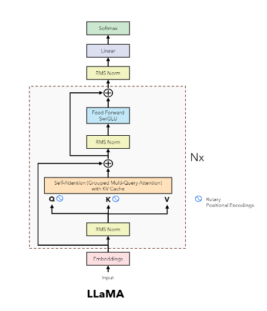

## llama1
llama1 是一个预训练模型，对标GPT3.
### 扩展法则
llama1 的作者提及了一个扩展法则的概念

[Chinchilla scaling laws](https://arxiv.org/pdf/2203.15556)

要点：
- 缩放法则：最优的令牌与参数比率约为2500亿令牌每10亿参数。
- 性能：在更多数据上训练的小型模型可以与在较少数据上训练的大型模型表现出相当的性能。
- 推理效率：小型模型在推理过程中可以更高效，这对于实际应用非常重要。
### Tokenizer
- BPE 算法，SentencePiece实现
- 所有的数字会被拆分成单个数字
- 无法正确解析的 UTF-8 编码字符会转成字节序列
- FFN中间维度：8/3d
### 模型架构

【1】
- Pre-normalization( RMSNorm)
- SwiGLU
- Rotary Embeddings

### 训练设置
优化器：AdamW
- β1 =0.9,β2 =0.95
- cosine learning rate schedule，衰减至最大值的10%
- weight decay 0.1
- gradient clipping 1
- warmup steps 2,000
#### 预训练数据

训练数据来自多个开源数据集。

#### 预训练

- LLaMA-33B、LLaMA-65B：1.4T token
- LLaMA-7B、LLaMA-13B：1T token
- batch size： 4M tokens
- 65B 参数模型在2048个A100(80G)上训练1.4T token大约需要 21 天

### 高效实现
- 减少了在反向传播过程中需要重新计算的激活的数量
- 模型并行性和序列并行
- 重叠激活的计算与GPU之间的网络通信

 
 

## llama2
Hoffmann等人 (2022) 的扩展法则的目标是确定如何在特定的训练计算预算下最佳地扩展数据集和模型的规模。
给定一个性能目标水平，理想的模型不是训练速度最快的，而是推理速度最快的。
例如，尽管Hoffmann等人 (2022) 建议在2000亿个令牌上训练100亿参数的模型，我们发现70亿参数的模型即使在1万亿个令牌之后性能仍然在持续提高。

### Tokenizer
- 同llama1
- 词表32k
### 模型架构
- 相比于llama1,llama2的预训练语料提升了40%，上下文长度翻倍到4k。
- 采用了grouped-query attention(GQA)机制
- 首次推出chat模型
- 幽灵注意力（GAtt）：有助于控制多轮对话的流程
 

### 训练设置
优化器：AdamW
- β1 =0.9,β2 =0.95,eps =10−5
- cosine learning rate schedule，衰减至最大值的10%
- weight decay 0.1
- gradient clipping 1
- warmup steps 2,000
#### 预训练

训练2Ttokens后模型仍然没有饱和。

### post阶段训练

 
#### SFT
- cosine learning rate schedule
- initial learning rate of 2 × 10e−5
- weight decay of 0.1
- a batch size of 64
- a sequence length of 4096 tokens.
-  2 epochs

#### 对齐
#### 设置
- one epoch
- maximum learning rate is 5 × 10−6 for the 70B Llama 2-Chat and 1 × 10−5 for the rest.
- warm-up of 3% of the total number of steps, with a minimum of 5. 
- effective batch size is kept fixed at 512 pairs, or 1024 rows per batch.
- For the 7B and 13B, β =0.01 (KL penalty), for 34B and 70B models, β =0.005.
##### 偏好数据
偏好对，且有偏好程度（显著更好、较好、略好或几乎相同/不确定）。
##### 奖励模型
训练了两个独立的奖励模型，一个是为了优化有用性（称为有用性RM），另一个是为了优化安全性（安全性RM）。
模型架构和超参数与预训练语言模型相同，只是将用于下一个令牌预测的分类头替换为输出标量奖励的回归头。

其中，m(r) 是偏好评级的一个离散函数。
##### Iterative Fine-Tuning
算法:PPO和拒绝采样

### 参考
【1】https://github.com/hkproj/pytorch-llama-notes

