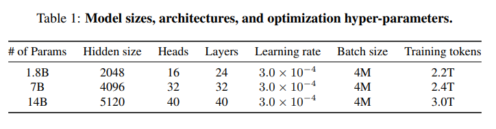

#Qwen
千问系列模型，包含预训练模型、代码(SFT)、数学(SFT)、视觉语言模型（SFT）对话模型（RLHF）和奖励模型

### 数据
- 公共网络文档、百科全书、书籍、代码等
- 多语言，中英文为主
- 精确匹配去重以及使用 MinHash 和 LSH 算法进行模糊去重
- 使用语言模型、文本质量评分模型以及用于识别潜在冒犯或不适当内容的模型过滤低质量数据
- 3T tokens
### Tokenizer
 - BPE,tiktoken实现
 - 词表：cl100k base + 中文及其他语言增强，数字被拆分为单个数字，最后词表大小约152k
### 模型架构
 
基于Llama,修改点包括：
- 非绑定（untied）嵌入
- RoPE，用FP32 精度用于逆频率矩阵
- 偏置，在注意力机制的 QKV 层中添加了偏置项
- Pre-Norm & RMSNorm
- SwiGLU,8/3d hidden size

### 训练设置
- context lengths:2024
- Flash Attention
- 优化器：AdamW，s β1 = 0.9, β2 = 0.95, ϵ = 10e−8
- cosine learning rate schedule，衰减至最大值的10%
- BFloat16 mixed precision

#### 预训练
 -使用多任务指令对语言模型进行预训练可以增强其零样本和少量样本学习的性能，因此在预训练过程中纳入了高质量的指令数据。
### post阶段训练