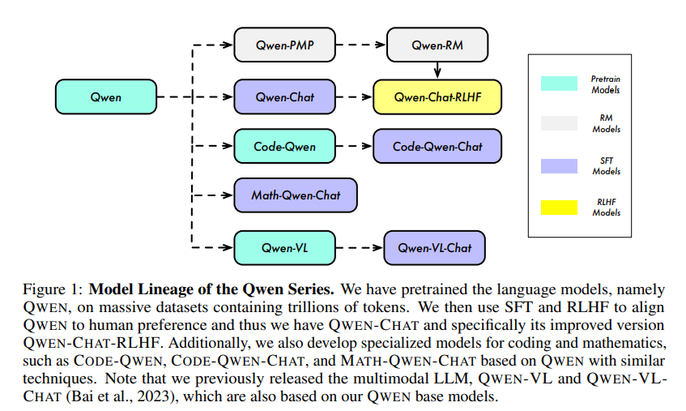
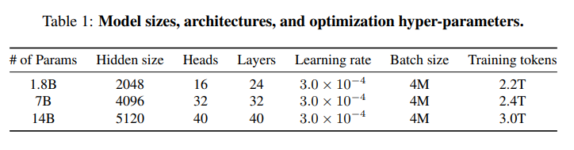
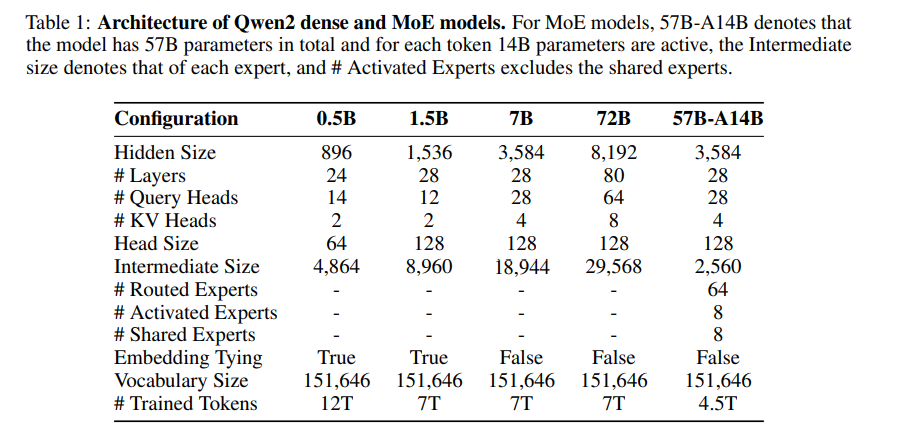
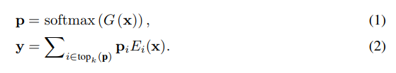

#Qwen
千问系列模型，包含预训练模型、代码(SFT)、数学(SFT)、视觉语言模型（SFT）对话模型（RLHF）和奖励模型
\

- 上下文长度扩展，推理阶段用NTK-aware 插值
- 两种注意力机制：LogN-Scaling和和窗口注意力
- 观察：较低层相比高层在扩展上下文长度时更为敏感
- 观察:训练方法对模型最终性能有显著影响。
### 数据
- 公共网络文档、百科全书、书籍、代码等
- 多语言，中英文为主
- 精确匹配去重以及使用 MinHash 和 LSH 算法进行模糊去重
- 使用语言模型、文本质量评分模型以及用于识别潜在冒犯或不适当内容的模型过滤低质量数据
- 3T tokens
### Tokenizer
 - BPE,tiktoken实现
 - 词表：cl100k base + 中文及其他语言增强，数字被拆分为单个数字，最后词表大小约152k
### 模型架构
 
基于Llama,修改点包括：
- 非绑定（untied）嵌入
- RoPE，用FP32 精度用于逆频率矩阵
- 偏置，在注意力机制的 QKV 层中添加了偏置项
- Pre-Norm & RMSNorm
- SwiGLU,8/3d hidden size

### 训练设置
- context lengths:2024
- Flash Attention
- 优化器：AdamW，s β1 = 0.9, β2 = 0.95, ϵ = 10e−8
- cosine learning rate schedule，衰减至最大值的10%
- BFloat16 mixed precision

### 预训练
 - 使用多任务指令对语言模型进行预训练可以增强其零样本和少量样本学习的性能，因此在预训练过程中纳入了高质量的指令数据。

### SFT
- ChatML 风格的格式
- 对人类风格的对话进行标注
#### 训练设置
- batch_size 128
- step 4000(warm up  1430)
- weight decay 0.1
- dropout 0.1
- 梯度clip 1
- 最大学习率：2 × 10e−6

### post阶段训练
#### reward model
 - 使用与 QWEN 相同规模的预训练语言模型作为基础。
 - 在模型中加入一个池化层用于从特定的结束标记提取句子的奖励值。
 - 设置学习率为 3 × 10e−6，批次大小为 64，序列长度为 2048。
 - 训练过程持续一个周期。
#### ppo
 - 策略模型和价值模型的学习率分别设置为 1 × 10^−6 和 5 × 10^−6
 - 采取同时为每个查询采样两个响应的策略
 - 价值损失裁剪，裁剪值为 0.15
 - 策略 top-p 设定为 0.9
 - 实现了预训练梯度以减轻对齐税

### 工具使用
- Utilizing unseen tools through ReAct prompting 
- 使用 Python 代码解释器来增强数学推理、数据分析等功能
- 作为agent访问 Hugging Face 的大量多模态模型并与人类互动
##### 训练
- 自我指导 (self-instruct) 策略来进行监督微调 (SFT)
- 样本集大约包含 2000 个高质量样本
- 将这些高质量样本与所有其他通用 SFT 样本混合在一起

## CODE-QWEN
- 从基础模型 QWEN 开始，继续在大约 900 亿个代码token数据上预训练
- 3% 的预热迭代次数且不进行学习率衰减
- 训练模型以支持长达 8192 的上下文长度
- 学习率,CODE-QWEN-14B:6.0 × 10e−5 / CODE-QWEN-7B:3.0 × 10e−5
- sft阶段，发现多阶段监督微调 (SFT) 策略相比其他方法表现最佳

## MATH-QWEN
- 在增强的数学指导数据集上进行了数学监督微调 (SFT)
- 使用了 1024 的序列长度来进行更快的训练
- 数学 SFT 数据集中的大多数用户输入都是考试题目
- 学习率峰值设置为 2 × 10e−5 
- 训练步数为 50,000 

#Qwen2

### Tokenizer
 - 同qwen
 - 所有模型都使用一个共同的词汇表，其中包括151,643个常规tokens和3个控制tokens。
### 模型架构
- 双块注意力机制(Dual Chunk Attention, DCA)
- YARN,重新缩放注意力权重
#### MOE

- 粒度：细粒度专家（Dai等人, 2024），创建了更小规模的专家，同时激活更多的专家
- 路由：MoE层中整合共享专家和特定路由的专家（Rajbhandari等人, 2022; Dai等人, 2024）
- 初始化：upcycling（Komatsuzaki等人, 2023）的方式初始化专家